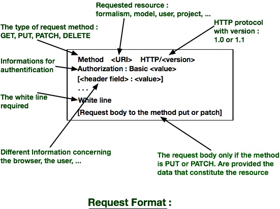
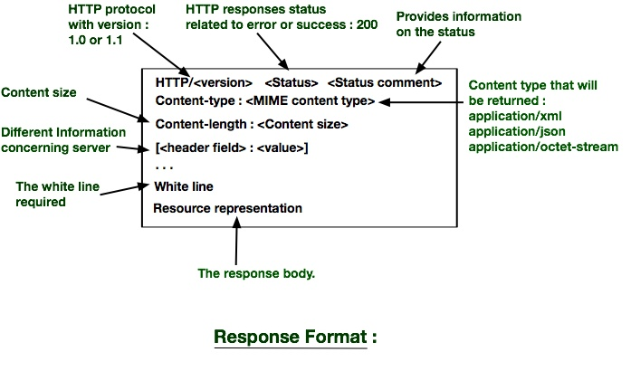

System Architecture and Protocol
================================

The system follows a client/server architecture. Expected clients are: web,
mobile phone, console and libraries. The server is required to be a RESTful
application (see [Representational state transfer]
(http://en.wikipedia.org/wiki/Representational_state_transfer)).

_Add here some explanations about REST:_
* HTTP requests,
* URLs for resources
* HTTP verbs for methods
* Status codes for results
* Request and results contents

The server thus is defined by its __resources__ and the __actions__ allowed
on them. This solution is adapted to the system (_why?_), is simple to
implement (_reference?_) and has several advantages (_over what? which
advantages?_).

This document defines:
* the resources, their contents and their representations,
* the supported methods, their inputs, outputs and status codes.


Resources
---------

The system makes use of the following resources:
* users,
* formalisms,
* models,
* converters,
* scenarios,
* services,
* executions,
* projects.

_Here we are missing a document that presents all these notions. Perhaps
you should write another sheet on `requirements`._

To identify resources, REST uses [Uniform Ressource
Identifiers](http://fr.wikipedia.org/wiki/Uniform_Resource_Identifier)
(URIs). A client requests a resource to the server by providing it with the
URI of the resource. There are two kinds of resources in this application:
* __resources collections__;
* __resources__.
They are distinguished by the use of the singular form (for single resources)
or the plural form (for resources collections).

For instance,
 * `/users/` represents a collection of users;
 * `/users/rokysaroi` represents the user `rokysaroi` in the `users`
   collection.

_You should also tell about the hierarchy of resources. Some resources can
or must be put within other ones._

The server exposes the following resources. A resource name starting with
`:`, for instance `:user`, is a variable. The following list also shows the
hierarchy of resources. The notation `(a|b)` tells that a resource is
available for prefixes `a` and `b`.

* `/`: _explain_
* `/users`:
* `/projects`:
* `/(users|projects)/:id`:
* `/(users|projects)/:id/formalisms`:
* `/(users|projects)/:id/formalisms/:formalism`:
* `/(users|projects)/:id/formalisms/:formalism/converters`:
* `/(users|projects)/:id/formalisms/:formalism/converters/:to`:
* `/(users|projects)/:id/models`:
* `/(users|projects)/:id/models/:model`:
* `/(users|projects)/:id/scenarios`:
* `/(users|projects)/:id/scenarios/:scenario`:
* `/(users|projects)/:id/services`:
* `/(users|projects)/:id/services/:service`:
* `/(users|projects)/:id/executions`:
* `/(users|projects)/:id/executions/:execution`:
* `/users/:id/projects`:
* `/users/:id/projects/:project`: redirects to a project
* `/projects/:id/users`:
* `/projects/:id/users/:user`: redirects to a user


A resource is can have several representations (XML, JSON, image, CosyVerif
format, CAMI, PNML, ...). Internally, the server uses the CosyVerif
representation for the following resources: formalism, model, scenario,
service, execution.

Clients are allowed to ask for a particular representation in their
requests. Whenever possible, the server performs a conversion of the
resource to the required format.

### Example: representation of a collection of resources and a resource

One user in `XML`:

````xml
<user xmlns='http://example.org/mon-exemple-ns/'>
  <first-name>First name</first-name>
  <last-name>Last name</last-name>
  <login>User name</login>
  <phone>Phone number</phone>
</user>
````

The same in `JSON`:

````json
{
  "user": {
    "first-name" : "First name",
    "last-name" : "Last name",
    "login" : "User name",
    "phone" : "Phone number"
  }
}
````

A collection of users in `XML`:

````xml
<users xmlns='http://example.org/mon-exemple-ns/'>
  <user-ref href="first user URI">complete name first user</user-ref>
  <user-ref href="second user URI"/>complete name second user</user-ref>
  ...
  <user-ref href="last user URI"/>complete name last user</user-ref>
</users>
````

The same in `JSON`:

````json
{
  "users": {
    "user-ref" : [
      {"href" : "First user URI", "name" : "complete name of first user"},
      {"href" : "Second user URI", "name" : "complete name of second user"},
      ...
      {"href" : "Last user URI", "name" : "complete name of last user"}
    ]
  }
}
````

_The presentation of all representation formats resources here ......_.


Methods and status codes
------------------------

The REST architecture is based on the `HTTP` protocol. Therefore, the same methods are more or less used 
the latter to take advantage of its standardization. Agents can use a URI to access the referenced resource. 
This is the concept of URI dereference. Access can take various forms, such as obtaining a representation of the resource
(for example, using a `GET` or a `HEAD` HTTP), adding or editing a resource (for example, using a `POST` or a `PUT` HTTP)
and deleting a resource (for example, via a `DELETE` HTTP).

Methods will be integrated into the system are :

* __GET__ : Get resource representation,
* __PUT__ : update a resource,
* __PATCH__ : update a resource partially,
* __DELETE__ : Delete a resource. 


Each HTTP response contains a code (`Status code`). This code uses the server to inform the client of the status of the 
processing of his demands and an `HTTP client` will automatically process the response. The status code is a numeric 
code and a description giving a humanly understandable response. Here is the list of code that will be used :

 
 <table width ="100%" style="border-collapse: collapse;" align="center">
 <tr><th style="border: 1px solid black;">Code</th><th style="border: 1px solid black;">Message</th><th style="border: 1px solid black;">Signification</th></tr>
  <tr><td style="border: 1px solid black;">200</td><td style="border: 1px solid black;">OK</td><td style="border: 1px solid black;">Request successfully processed</td></tr>
  <tr><td style="border: 1px solid black;">201</td><td style="border: 1px solid black;">Created</td><td style="border: 1px solid black;">The resource was create</td></tr>
  <tr><td style="border: 1px solid black;">204</td><td style="border: 1px solid black;">No Content</td><td style="border: 1px solid black;">Request successfully processed but no information to return</td></tr>
  <tr><td style="border: 1px solid black;">400</td><td style="border: 1px solid black;">Bad Request</td><td style="border: 1px solid black;">The query syntax is incorrect</td></tr>
  <tr><td style="border: 1px solid black;">401</td><td style="border: 1px solid black;">Unauthorized</td><td style="border: 1px solid black;">Authentication is required to access the resource</td></tr>
  <tr><td style="border: 1px solid black;">403</td><td style="border: 1px solid black;">Forbidden</td><td style="border: 1px solid black;">The server understood the request, but is refusing to execute. Unlike the 401 error, authenticate not make any difference. On servers where authentication is required, it usually means that authentication has been accepted but the permissions do not allow the client to access the resource</td></tr>
  <tr><td style="border: 1px solid black;">404</td><td style="border: 1px solid black;">Not Found</td><td style="border: 1px solid black;">Resource Not Found</td></tr>
  <tr><td style="border: 1px solid black;">405</td><td style="border: 1px solid black;">Method Not Allowed</td><td style="border: 1px solid black;">Method unauthorized request</td></tr>
  <tr><td style="border: 1px solid black;">410</td><td style="border: 1px solid black;">Gone</td><td style="border: 1px solid black;">The resource is unavailable and no forwarding address is known. This code is used for deleted resources; we put information in place of a deleted resource.</td></tr>
  <tr><td style="border: 1px solid black;">415</td><td style="border: 1px solid black;">Unsupported Media Type</td><td style="border: 1px solid black;">Request format not supported for a method and resource data</td></tr>
  <tr><td style="border: 1px solid black;">422</td><td style="border: 1px solid black;">Unprocessable entity</td><td style="border: 1px solid black;">The entity provided with the application is incomplete or incomprehensible</td></tr>
  <tr><td style="border: 1px solid black;">500</td><td style="border: 1px solid black;">Internal Server Error</td><td style="border: 1px solid black;">Internal Server Error</td></tr>
  <tr><td style="border: 1px solid black;">501</td><td style="border: 1px solid black;">Not Implemented</td><td style="border: 1px solid black;">Requested feature not supported by the server</td></tr>
 </table>

 
These status codes are specified by RFC 2616, along with other status codes, not standard but widely used on the web.


Were defined URI, selected representations, determine methods and status codes, we need to marry together. 
At least, we need to choose a representation in response to each GET and representation to send to each 
PUT et PATCH. The combination of resource representations, methods, and status codes is as :

 <table width ="100%" style="border-collapse: collapse;" align="center">
 <tr><th style="border: 1px solid black;">Resource</th><th style="border: 1px solid black;">Method</th><th style="border: 1px solid black;">Representation</th><th style="border: 1px solid black;">Status code</th></tr>
  <tr><td style="border: 1px solid black;">User</td><td style="border: 1px solid black;">GET</td><td style="border: 1px solid black;">user format</td><td style="border: 1px solid black;">200, 400, 401, 403, 404, 410, 415, 500</td></tr>
  <tr><td style="border: 1px solid black;">User</td><td style="border: 1px solid black;">PUT</td><td style="border: 1px solid black;">user format</td><td style="border: 1px solid black;">200, 201, 400, 401, 403, 415, 500</td></tr>
  <tr><td style="border: 1px solid black;">User</td><td style="border: 1px solid black;">DELETE</td><td style="border: 1px solid black;">N/A</td><td style="border: 1px solid black;">200, 204, 401, 403, 404, 500</td></tr>
  <tr><td style="border: 1px solid black;">All user</td><td style="border: 1px solid black;">GET</td><td style="border: 1px solid black;">Format all-user</td><td style="border: 1px solid black;">200, 400, 401, 403, 404, 410, 415, 500</td></tr>
 </table>

 

 ##### Message formats exchanged


 There are two messages formats exchanged between a client and server :  the request format (request from a client to the server) 
 and response format (response of the server to the client that issued a request). A format consists of a header and a content.

 - A request is made by a client to do an action at the server level (get, create, update or delete). __the request format__ 
  consists of the requested ressource URI, the method (action to take on the resource), 
 the protocol version used by the client, headers and sometimes content (in the case of the PUT or PATCH). 


  

All fields headers are not mandatory, they are considered with respect to the action to be taken. Here's 
the list of header fields that will serve :


 <table width ="100%" style="border-collapse: collapse;" align="center">
 <tr><th style="border: 1px solid black;">Field</th><th style="border: 1px solid black;">Signification</th></tr>
  <tr><td style="border: 1px solid black;">authorization</td><td style="border: 1px solid black;">Identification user to the server</td></tr>
  <tr><td style="border: 1px solid black;">accept</td><td style="border: 1px solid black;">MIME types accepted by the client</td></tr>
  <tr><td style="border: 1px solid black;">accept-Encoding</td><td style="border: 1px solid black;">Data encoding accepted by the client</td></tr>
  <tr><td style="border: 1px solid black;">Accept-langage</td><td style="border: 1px solid black;">list of supported languages</td></tr>
  <tr><td style="border: 1px solid black;">Content-length</td><td style="border: 1px solid black;">Body length of the query</td></tr>
  <tr><td style="border: 1px solid black;">Content-Type</td><td style="border: 1px solid black;">Content type of the request body (for example application/json, application/xml)</td></tr>
 </table>


 - A response is made ​​by a server in response to a client who has requested. __response format__ consists of the response status
 (a code et a comment related to the success or error), the protocol version used by the server, headers and a content (not the 
 content in case of PUT or DELETE). 


 

 All fields headers are not mandatory. Here's the list of header fields that will serve :


 <table width ="100%" style="border-collapse: collapse;" align="center">
 <tr><th style="border: 1px solid black;">Field</th><th style="border: 1px solid black;">Signification</th></tr>
  <tr><td style="border: 1px solid black;">www-authenticate</td><td style="border: 1px solid black;">The server does not receive identification header correct, sends the HTTP header</td></tr>
  <tr><td style="border: 1px solid black;">Server</td><td style="border: 1px solid black;">Characteristics of the server that sent the response</td></tr>
  <tr><td style="border: 1px solid black;">Content-length</td><td style="border: 1px solid black;">Body length of the query</td></tr>
  <tr><td style="border: 1px solid black;">Content-Type</td><td style="border: 1px solid black;">Content type of the request body (for example application/json, application/xml)</td></tr>
 </table> 

 <br/>


 The langage to be used for the realization of the server is `PHP` with the `Slim` framework and other tools to 
 help benefit the development (Composer, box, ...).


 #FRANCH PARTY


 # Architecture et protocole du système

 Le système est composé d'un serveur et des agents (navigateur web, terminal de commandes, 
client mobile, client léger ou client riche, ...). Le mode de communication est un mode client-serveur.
 
 Le serveur abrite des ressources et des services. Donc, les demandes de clients que le serveur doit satisfaire 
 sont l'obtention et le mise à jour des ressources et l'exécution  des services.

 Le style d'architecture `REST` (Representational State Transfer) sera utilisé pour le développement du système. 
 Cette solution est adapté à notre système, est simple à mettre en oeuvre et présente des avantages. 

 Le langage qui sera utilisé pour la réalisation du serveur est `PHP` avec le framework `Slim` et d'autres outils
 pour faciliter d'avantage son développement (Composer, box, ...).


 ### Définition du protocole REST de notre système

 Dans cette partie, on va définir :
 * l'identification et la représentation des ressources du système
 * les méthodes supportées et les codes de statuts qui doit être renvoyé au client.

 ##### Identification  et la représentation des ressources
 Le système est constitué des ressources telles que des utilisateurs, des formalisms, des convertisseurs, des models, des scénarios,
 des services, des exécutions, des projets, ... 
 
 ###### _Identification :_

 Pour identifier des ressources, REST utilise les systèmes des URIs (Uniform Ressource Identifier). Ainsi, un client peut demander une ressource au serveur à lui 
 fournissant l'URI de la ressource. Une URI répresente soit __une collection de ressources__ ou soit __une ressource__. Exemple :

 * __une collection d'utilisateur __: /users
 * __un utilisateur__ : /users/alban

 Voici les URIs identifiés pour l'instant : 
/
/users
/users/:user
/users/:user/formalisms
/users/:user/formalisms/:formalism
/users/:user/formalisms/:formalism/converters
/users/:user/formalisms/:formalism/converters/:converter
/users/:user/models
/users/:user/models/:model
/users/:user/scenarios
/users/:user/scenarios/:scenario
/users/:user/services
/users/:user/services/:service
/users/:user/executions
/users/:user/executions/:execution
/users/:user/projects
/users/:user/projects/:project
/users/:user/projects/:project/formalisms
/users/:user/projects/:project/formalisms/:formalism
/users/:user/projects/:project/formalisms/:formalism/converters
/users/:user/projects/:project/formalisms/:formalism/converters/:converter
/users/:user/projects/:project/models
/users/:user/projects/:project/models/:model
/users/:user/projects/:project/scenarios
/users/:user/projects/:project/scenarios/:scenario
/users/:user/projects/:project/services
/users/:user/projects/:project/services/:service
/users/:user/projects/:project/executions
/users/:user/projects/:project/executions/:execution
/projects
/projects/:project
/projects/:project/formalisms
/projects/:project/formalisms/:formalism
/projects/:project/formalisms/:formalism/converters
/projects/:project/formalisms/:formalism/converters/:converter
/projects/:project/models
/projects/:project/models/:model
/projects/:project/scenarios
/projects/:project/scenarios/:scenario
/projects/:project/services
/projects/:project/services/:service
/projects/:project/executions
/projects/:project/executions/:execution


 ###### _Représentation :_

 Une ressource est indépendante de sa représentation et peut en avoir plusieurs (XML, JSON, IMAGE, COSY, CAMI, PNML, ...). 
 Une représentation est le résultat soit du formatage des informations d'une ressource ou le format de la ressource,
 elle-même, supporté par le serveur. C'est cette représentation qui représente les données échangées entre un client
 et le serveur. Un type de représentation est fournis à un client à sa demande ou un type par défaut supporté par 
 celui-ci. 
 
 __Exemple de représenation en XML d'une collection de ressources et d'une ressource__ :


<user xmlns='http://example.org/mon-exemple-ns/'>
    <first-name>First name</first-name>
    <last-name>Last name</last-name>
    <login>User name</login>
    <phone>Phone number</phone>
</user>

 -

<users xmlns='http://example.org/mon-exemple-ns/'>
    <user-ref href="first user URI">complete name first user</user-ref>
    <user-ref href="second user URI"/>complete name second user</user-ref>
      .
      .
    <user-ref href="last user URI"/>complete name last user</user-ref>
</users>


 __Exemple de représenation en JSON d'une collection de ressources et d'une ressource__ :


{
  "user":{
    "first-name" : "First name",
    "last-name" : "Last name",
    "login" : "User name",
    "phone" : "Phone number"
  }
}
 -
{
  "users":{
    "user-ref" : [
      {"href" : "First user URI", "name" : "complete name of first user"},
      {"href" : "Second user URI", "name" : "complete name of second user"},
      .
      .
      {"href" : "Last user URI", "name" : "complete name of last user"}
    ]
}


 `La présentation de tous les formats de réprésenation de ressources ici .......` 


 ##### Méthodes et codes de status

 L'architecture REST se base sur le protocole `HTTP`. Donc, on utilisera
 plus ou moins les mêmes méthodes que ce dernier afin de profiter de son standardisation. 
 Les agents peuvent utiliser un URI pour accéder à la ressource référencée. 
 C'est le concept de déréférencement d'URI. L'accès peut prendre diverses formes, comme l'obtention d'une 
 représentation de la ressource (par exemple, en utilisant un `GET` ou un `HEAD` HTTP), l'ajout ou la modification 
 d'une ressource (par exemple, en utilisant un `POST` ou un `PUT` HTTP) et la suppression de la ressource (par exemple,
 via un `DELETE` HTTP).

 Les méthodes qui seront intégrées à notre systèmes sont :

 * __GET__ : Obtenir la représentation d'une ressource,
 * __PUT__ : Mettre à jour une ressource,
 * __PATCH__ : Mettre à jour une ressource partiellement,
 * __DELETE__ : Effacer une ressource. 


 Chaque réponse du protocole `HTTP` contient un code (`Code de status`). Ce code sert au serveur d'informer le client de
 l'état du traitement de sa demande ainsi un client HTTP` pourra traiter automatiquement la réponse. Le code de status est
 un code numérique et une description donnant une réponse humainement compréhensible. Voici la liste de code qu'on va utiliser :

 
 <table width ="100%" style="border-collapse: collapse;" align="center">
 <tr><th style="border: 1px solid black;">Code</th><th style="border: 1px solid black;">Message</th><th style="border: 1px solid black;">Signification</th></tr>
  <tr><td style="border: 1px solid black;">200</td><td style="border: 1px solid black;">OK</td><td style="border: 1px solid black;">Requête traitée avec succès</td></tr>
  <tr><td style="border: 1px solid black;">201</td><td style="border: 1px solid black;">Created</td><td style="border: 1px solid black;">Requête traitée avec succès avec création d’un document</td></tr>
  <tr><td style="border: 1px solid black;">204</td><td style="border: 1px solid black;">No Content</td><td style="border: 1px solid black;">Requête traitée avec succès mais pas d’information à renvoyer</td></tr>
  <tr><td style="border: 1px solid black;">400</td><td style="border: 1px solid black;">Bad Request</td><td style="border: 1px solid black;">La syntaxe de la requête est erronée</td></tr>
  <tr><td style="border: 1px solid black;">401</td><td style="border: 1px solid black;">Unauthorized</td><td style="border: 1px solid black;">Une authentification est nécessaire pour accéder à la ressource</td></tr>
  <tr><td style="border: 1px solid black;">403</td><td style="border: 1px solid black;">Forbidden</td><td style="border: 1px solid black;">Le serveur a compris la requête, mais refuse de l'exécuter. Contrairement à l’erreur 401, s'authentifier ne fera aucune différence. Sur les serveurs où l'authentification est requise, cela signifie généralement que l'authentification a été acceptée mais que les droits d'accès ne permettent pas au client d'accéder à la ressource</td></tr>
  <tr><td style="border: 1px solid black;">404</td><td style="border: 1px solid black;">Not Found</td><td style="border: 1px solid black;">Ressource non trouvée</td></tr>
  <tr><td style="border: 1px solid black;">405</td><td style="border: 1px solid black;">Method Not Allowed</td><td style="border: 1px solid black;">Méthode de requête non autorisée</td></tr>
  <tr><td style="border: 1px solid black;">410</td><td style="border: 1px solid black;">Gone</td><td style="border: 1px solid black;">La ressource est indisponible et aucune adresse de redirection n’est connue. Ce code sera utilisé pour les ressources supprimées ; on mettra une information à la place d'une ressource supprimée.</td></tr>
  <tr><td style="border: 1px solid black;">415</td><td style="border: 1px solid black;">Unsupported Media Type</td><td style="border: 1px solid black;">Format de requête non supporté pour une méthode et une ressource données</td></tr>
  <tr><td style="border: 1px solid black;">422</td><td style="border: 1px solid black;">Unprocessable entity</td><td style="border: 1px solid black;">L’entité fournie avec la requête est incompréhensible ou incomplète</td></tr>
  <tr><td style="border: 1px solid black;">500</td><td style="border: 1px solid black;">Internal Server Error</td><td style="border: 1px solid black;">Erreur interne du serveur</td></tr>
  <tr><td style="border: 1px solid black;">501</td><td style="border: 1px solid black;">Not Implemented</td><td style="border: 1px solid black;">Fonctionnalité réclamée non supportée par le serveur</td></tr>
 </table>

 
 Ces codes de statuts ont été spécifiés par la `'RFC 2616, en même temps que d’autres codes de statuts, non normalisés mais très utilisés sur le web.
 

 On a défini les URI, choisi les représentations, décider des méthodes et des codes de status, on a besoin de les marier tous ensemble. 
 Au moins, on a besoin de choisir une représentation en réponse à chaque GET et une représentation à envoyer pour chaque 
 PUT et PATCH. L'association des ressources, les représenttions, les méthodes, et les codes de status se présente ainsi :

 <table width ="100%" style="border-collapse: collapse;" align="center">
 <tr><th style="border: 1px solid black;">Ressource</th><th style="border: 1px solid black;">Méthode</th><th style="border: 1px solid black;">Répresentation</th><th style="border: 1px solid black;">Codes de status</th></tr>
  <tr><td style="border: 1px solid black;">User</td><td style="border: 1px solid black;">GET</td><td style="border: 1px solid black;">Format user</td><td style="border: 1px solid black;">200, 400, 401, 403, 404, 410, 415, 500</td></tr>
  <tr><td style="border: 1px solid black;">User</td><td style="border: 1px solid black;">PUT</td><td style="border: 1px solid black;">Format user</td><td style="border: 1px solid black;">200, 201, 400, 401, 403, 415, 500</td></tr>
  <tr><td style="border: 1px solid black;">User</td><td style="border: 1px solid black;">DELETE</td><td style="border: 1px solid black;">N/A</td><td style="border: 1px solid black;">200, 204, 401, 403, 404, 500</td></tr>
  <tr><td style="border: 1px solid black;">All user</td><td style="border: 1px solid black;">GET</td><td style="border: 1px solid black;">Format all-user</td><td style="border: 1px solid black;">200, 400, 401, 403, 404, 410, 415, 500</td></tr>
 </table>

 

 ##### Les formats de message échangés


 Il y a deux formats de message échangés entre un client et le serveur :  le format d'une demande (demande d'un client au serveur) 
 et le format d'une réponse (réponse du serveur au client qui a émis une demande). Un format est constitué d'une entête et un contenu.

 - Une demande est formulée par un client pour effectuer une action au niveau du serveur (recupération, création, mise à jour ou suppression). __Le format de la demande__ 
 est constitué de l'URI de la ressource demandée, de la méthode (l'action à entreprendre sur la ressource), 
 la version du protocole utilisé par le client, des entêtes et parfois un contenu (dans le cas de la méthode PUT ou PATCH). 


  

 Tous les champs d'entêtes ne sont pas obligatoires, ils sont considérés par rapport à l'action à entreprendre. Voilà la liste
 de champs d'entête qu'on va se servir :


 <table width ="100%" style="border-collapse: collapse;" align="center">
 <tr><th style="border: 1px solid black;">Champ</th><th style="border: 1px solid black;">Signification</th></tr>
  <tr><td style="border: 1px solid black;">authorization</td><td style="border: 1px solid black;">Identification de l'utilisateur auprès du serveur</td></tr>
  <tr><td style="border: 1px solid black;">accept</td><td style="border: 1px solid black;">Types MIME acceptés par le client</td></tr>
  <tr><td style="border: 1px solid black;">accept-Encoding</td><td style="border: 1px solid black;">Codage de données accepté par le client</td></tr>
  <tr><td style="border: 1px solid black;">Accept-langage</td><td style="border: 1px solid black;">liste de langues supportées</td></tr>
  <tr><td style="border: 1px solid black;">Content-length</td><td style="border: 1px solid black;">Longueur du corps de la requête</td></tr>
  <tr><td style="border: 1px solid black;">Content-Type</td><td style="border: 1px solid black;">Type de contenu du corps de la requête (par exemple application/json, application/xml)</td></tr>
 </table>


 - Une réponse est formulée par un serveur en réponse à un client qui a fait une demande. __Le format de la reponse__ est 
 constitué du status de la réponse (un code et un commentaire liés au succès ou à l'erreur), laa version du protocole 
 utilisé par le client, des entêtes et un contenu (pas de contenu dans le cas de PUT et DELETE). 


 

 Tous les champs d'entêtes ne sont pas obligatoires. Voilà la liste
 de champs d'entête qu'on va se servir :


 <table width ="100%" style="border-collapse: collapse;" align="center">
 <tr><th style="border: 1px solid black;">Champ</th><th style="border: 1px solid black;">Signification</th></tr>
  <tr><td style="border: 1px solid black;">www-authenticate</td><td style="border: 1px solid black;">Le serveur ne recevant pas d'en-tête d'identification correcte envoie cet en-tête HTTP</td></tr>
  <tr><td style="border: 1px solid black;">Server</td><td style="border: 1px solid black;">Caractéristiques du serveur ayant envoyé la réponse</td></tr>
  <tr><td style="border: 1px solid black;">Content-length</td><td style="border: 1px solid black;">Longueur du corps de la requête</td></tr>
  <tr><td style="border: 1px solid black;">Content-Type</td><td style="border: 1px solid black;">Type de contenu du corps de la requête (par exemple application/json, application/xml)</td></tr>
 </table> 

 
